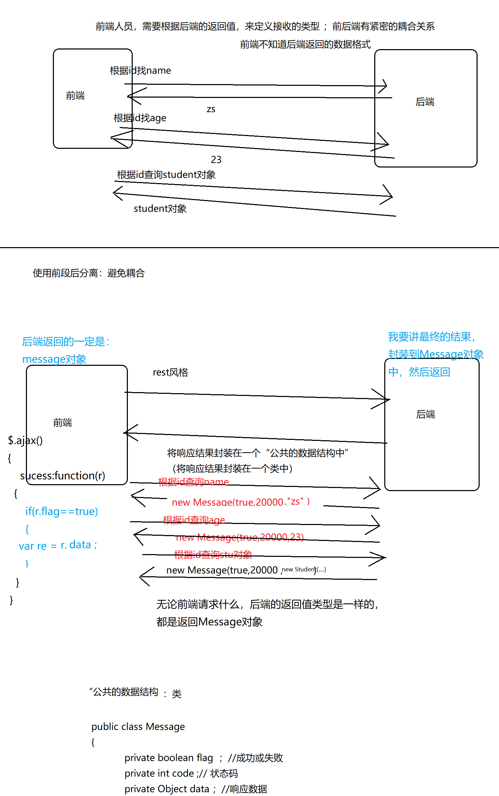

# 微服务

前置基础：java基础（javase ，数据库，ssm ,spring boot基础  ，mvn, git）

课程内容： spring boot高级、spring cloud 、容器化技术(docker相关)


选型：

1.尽可能的包含目前大部分主流的微服务技术

2.前沿、尽可能使用 之前课程没有出现的技术。例如，用jpa 取代mybatis，例如mysql取代oracle


授课方式：

案例，不是项目。

案例：为了学技术。 写的代码，可能不能实现某一个功能，而是为了学习。

项目：为了实现功能。 要求代码统一、技术统一，每一行代码 都是为了做一个“功能”


大体的代码：

spring全家桶

控制器：springmvc  （servlet）

数据访问：springdata + jpa  (jdbc)


基于前后端分离  ： 

1.采用rest风格开发。 （1）发送的请求支持 get查  post增  delete删  put改 等四种请求方式。

（2）支持ant写法，  http://localhost:8888/findById/1/zs  (ant写法)

​                                     http://localhost:8888/findById?id=1 & name=zs 

2.(重点) 前端和后端共同维护一个共用的“数据结构”，从而实现 前端、后端各自独立开发，互不干涉。



### 项目结构

方案一： 将通用子工程作为 功能子模块的父工程


方案二： 将通用子工程 和 功能子模块，作为平级的工程，然后 用各个功能子模块 引入 通用子模块（本次采用）


父工程：microservice: pom.xml

通用子工程：micro_common

功能子模块1：城市管理 （ssm  + spring boot）

提示：1如果A是B的父工程。 那么当 手工删除B工程（子工程）之后，还需要手工的在 A（父工程）中，将B的module删除

提示2：建立spring boot项目时，有两种选择：

（1）创建maven项目，然后再pom中 手工引入 starter的依赖

（2）直接创建spring boot项目，可以在创建项目时 直接选择好starter

（3）项目名、类名、变量名：可以使用下划线（micro_city）；springboot中的yaml文件，不能有下划线，但可以有-   （micro-city.yml）

访问数据库,  jdbc,mybatis ,mysql

处理请求映射 web  (相当于引入spring mvc)


## 使用docker 准备数据库


docker优势：可以通过几行命令，就可以实现 各种服务的部署功能。


docker基于Linux（一般建议centos7），centos7详见以前课程。

进入centos7后，查看系统内核：uname -r，要求内核版本>=3.10

小结：docker使用的环境：centos7，并且uname >=3.10


准备docker容器：

1.下载docker

yum -y install docker

2.启动

systemctl start docker

开启自启

systemctl enable docker


在docker容器中 安装各个服务镜像。(mysql)

docker pull 镜像名字:版本号

准备工作：如何得知   镜像名字:版本号

（1）网站hub.docker.com，去里面搜索 Mysql，就能看到 mysql的各个版本号

（2）docker search mysql

通过以上方法，可以得知服务的版本号  （可以去各个服务器的官网，查看版本号）


给docker加速：

（1）通过加速网站

registry.docker-cn.com

daocloud.io/library

其他网站

(2)

在docker下载mysql :

docker pull mysql:5.5.61

加速：

docker pull  registry.docker-cn.com/mysql:5.5.61

docker pull daocloud.io/library/mysql:5.5.61


检查安装的镜像:

docker ps -a


安装：

docker run -di --name=micro_mysql -p 3306:3306 -e MYSQL_ROOT_PASSWORD=root123 daocloud.io/library/mysql:5.5.61

docker ps -a

启动mysql:

docker start  2b9f9ca5c2be

停止

docker stop  2b9f9ca5c2be

删除

docker rm  2b9f9ca5c2be


尝试：

使用navicate远程连接 centos7中 docker里的Mysql服务


测试工具：

postman


回顾：

mapper接口前的@Mapper 和@MapperScan(value="com.yanqun.micro_city.mapper") ，二选一即可。


在使用maven时，如果a依赖了b项目，但是无法import b中的api，解决方案：先将 b进行install，然后再import


通过本案例可以发现，以前较为复杂的ssm整合配置文件，都不需要编写了，因为spring boot已经内部帮我们配置过了。


在springboot中 使用ssm时需要的依赖：jdbc,mysql,mybatis, web

在idea中，要将所有的xml等配置文件 放入到resources中


使用配置文件的mybatis时，出现 invalidate  found...(找不到mapper.xml映射文件)，解决：

1.重启

2.如果重启后仍然失败，尝试通过Maven技术，强制保留mapper.xml

```xml
    <build>
        <resources>
            <resource>
                <directory>src/main/java</directory>
                <includes>
                    <include>**/*.xml</include>
                </includes>
                <filtering>false</filtering>
            </resource>
        </resources>
    </build>

```

做了一些尝试：

增加了一些注解 和一些配置。  

spring boot自动装配，帮我们配置一些东西 。 如果某些自动装配失效，那么可以尝试手工装配。


- micro_city:springboot+ssm +注解
- micro_city2:springboot+ssm +SQL映射文件
- micro_city3: springboot+ssm + 外部配置文件/配置类


micro_city3、micro_city4:不适用springboot的部分自动装配功能；而使用我们自定义的 配置文件、配置类

（1）外部配置文件：micro_city3

重点：要引入外部配置文件，需要在springboot入口类上加注解：

```java
@ImportResource(locations={"classpath:applicationContext.xml"})
@SpringBootApplication
public class MicroCityApplication {

    public static void main(String[] args) {
        SpringApplication.run(MicroCityApplication.class, args);
    }

}
```

问题总结：

1.springboot启动时，必须有 appication.properties/yaml

2.如果创建的是spring boot项目，项目在创建时会自动 创建一个入口类、测试类；我们直接在测试类中写方法即可。但是，如果是手工自己编写的测试类，并且这个测试类 和入口类 没有遵循maven约定，则需要 手工给测试类 指定 要测试的是哪个类。

```java

@SpringBootTest(classes = MicroCityApplication.class)
@RunWith(SpringRunner.class)
public class MiCro_CIty3_Test {
    ...
}
```


（2）配置类：micro_city4

```java
package micro_city4;

import micro_city4.dao.CityDao;
import micro_city4.entity.City;
import micro_city4.service.CityService;
import org.springframework.context.annotation.Bean;
import org.springframework.context.annotation.Configuration;

/*
 * Created by 颜群
 */
@Configuration
public class MyConfiguration {//配置类

    @Bean
    public CityService cityService(){
        CityService cityService = new CityService();
        CityDao cityDao = new CityDao();
        cityService.setCityDao(  cityDao    );
        return cityService ;
    }
}


```

说明：配置类 由于会在启动时被@SpringBootApplication扫描，因此 无需再家 @importReource...


